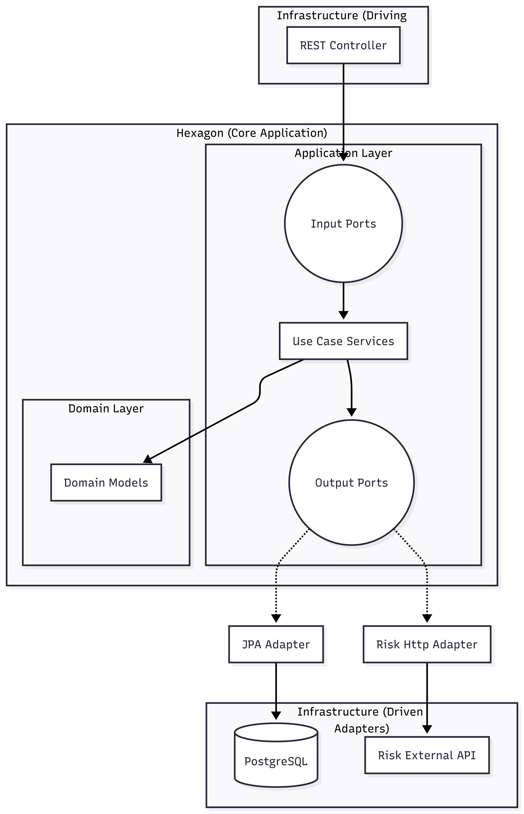
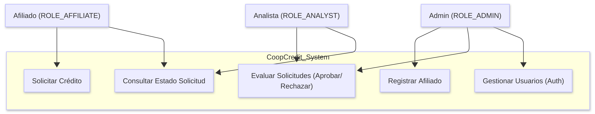
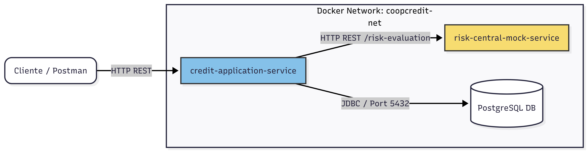
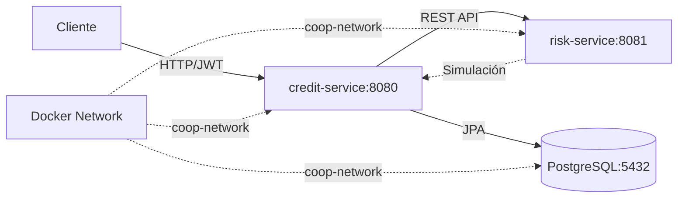

<div align="center">

# 🏦 CoopCredit

### Sistema Distribuido de Gestión de Solicitudes de Crédito

[](https://openjdk.org/projects/jdk/17/)
[](https://spring.io/projects/spring-boot)
[](https://www.docker.com/)
[](https://www.postgresql.org/)
[](https://jwt.io/)

**Sistema robusto basado en microservicios con Arquitectura Hexagonal para el manejo de flujos de solicitudes de crédito con enfoque en mantenibilidad y escalabilidad.**

[Características](#-características-principales) •
[Arquitectura](#️-arquitectura--diseño) •
[Comenzar](#-inicio-rápido) •
[Documentación](#-documentación-api) •
[Contribuir](#-cómo-contribuir)

</div>

---

## 📖 Sobre el Proyecto

CoopCredit es un sistema empresarial diseñado para gestionar el ciclo completo de solicitudes de crédito, desde el registro de afiliados hasta la evaluación de riesgo y aprobación.

### 🎯 Microservicios

El sistema está compuesto por dos microservicios independientes:

| Servicio | Descripción | Arquitectura | Puerto |
|----------|-------------|--------------|--------|
| **credit-application-service** | Servicio principal con lógica de negocio | Hexagonal (Ports & Adapters) | 8080 |
| **risk-central-mock-service** | Simulador de evaluación de riesgo externo | Arquitectura por Capas | 8081 |

---

## ✨ Características Principales

- ✅ **Arquitectura Hexagonal** - Aislamiento total del dominio
- ✅ **Seguridad JWT** - Autenticación stateless con tokens
- ✅ **API RESTful** - Endpoints bien documentados con Swagger
- ✅ **Base de Datos** - PostgreSQL con migraciones Flyway
- ✅ **Dockerizado** - Despliegue con Docker Compose
- ✅ **Monitoreo** - Métricas con Actuator y Prometheus
- ✅ **Testing Completo** - Tests unitarios e integración con Testcontainers
- ✅ **Logging Profesional** - SLF4J con niveles configurables
- ✅ **Manejo de Errores** - Excepciones personalizadas por tipo

---

## 🏗️ Arquitectura & Diseño

### Diagramas del Sistema

<table>
<tr>
<td width="33%">

#### Arquitectura Hexagonal

*Separación de Domain e Infrastructure*

</td>
<td width="33%">

#### Casos de Uso

*Roles: Afiliado, Analista, Admin*

</td>
<td width="33%">

#### Microservicios

*Contenedores Docker y Red*

</td>
</tr>
</table>

### Flujo de Comunicación



---

## 📂 Estructura Detallada del Proyecto

```text
CoopCredit/
│
├── 📄 README.md                              # Este archivo
├── 📄 docker-compose.yml                     # Orquestación de servicios
├── 📄 docker-compose.dev.yml                 # Configuración de desarrollo
├── 📄 pom.xml                                # Maven parent POM
│
├── 🖼️ Diagrama_de_Arquitectura_Hexagonal.png
├── 🖼️ Diagrama_de_Casos-de_Uso.png
├── 🖼️ Diagrama_de_Microservicios.png
│
├── 📁 prometheus/                            # Configuración de Prometheus
│   └── prometheus.yml
│
├── 📁 credit-application-service/            # 🎯 SERVICIO PRINCIPAL
│   ├── 📄 pom.xml                            # Dependencias del servicio
│   ├── 📄 Dockerfile                         # Imagen Docker producción
│   ├── 📄 Dockerfile.dev                     # Imagen Docker desarrollo
│   │
│   └── 📁 src/
│       ├── 📁 main/
│       │   ├── 📁 java/com/coopcredit/core/
│       │   │   │
│       │   │   ├── 📄 CreditApplicationServiceApplication.java  # Main class
│       │   │   │
│       │   │   ├── 📁 domain/                    # 🎯 CAPA DE DOMINIO (Puro Java)
│       │   │   │   ├── 📁 model/                 # Entidades de negocio
│       │   │   │   │   ├── 📄 Affiliate.java     # Modelo de afiliado
│       │   │   │   │   ├── 📄 Credit.java        # Modelo de crédito
│       │   │   │   │   ├── 📄 CreditStatus.java  # Estados del crédito
│       │   │   │   │   └── 📄 User.java          # Modelo de usuario
│       │   │   │   │
│       │   │   │   └── 📁 port/                  # Interfaces (Puertos)
│       │   │   │       ├── 📁 in/                # UseCase interfaces (entrada)
│       │   │   │       │   ├── 📄 ApplyForCreditUseCase.java
│       │   │   │       │   ├── 📄 EvaluateCreditUseCase.java
│       │   │   │       │   ├── 📄 GetCreditApplicationsUseCase.java
│       │   │   │       │   ├── 📄 RegisterAffiliateUseCase.java
│       │   │   │       │   ├── 📄 RegisterUserUseCase.java
│       │   │   │       │   └── 📄 UpdateAffiliateUseCase.java
│       │   │   │       │
│       │   │   │       └── 📁 out/               # Repository/Service interfaces (salida)
│       │   │   │           ├── 📄 AffiliateRepositoryPort.java
│       │   │   │           ├── 📄 CreditRepositoryPort.java
│       │   │   │           ├── 📄 UserRepositoryPort.java
│       │   │   │           ├── 📄 RiskServicePort.java
│       │   │   │           └── 📄 RiskEvaluationResult.java
│       │   │   │
│       │   │   ├── 📁 application/               # 🔧 CAPA DE APLICACIÓN
│       │   │   │   └── 📁 service/               # Implementación de casos de uso
│       │   │   │       ├── 📄 AffiliateService.java
│       │   │   │       ├── 📄 AffiliateUpdateService.java
│       │   │   │       ├── 📄 CreditEvaluationService.java
│       │   │   │       ├── 📄 CreditService.java
│       │   │   │       └── 📄 UserService.java
│       │   │   │
│       │   │   └── 📁 infrastructure/            # 🔌 CAPA DE INFRAESTRUCTURA
│       │   │       │
│       │   │       ├── 📁 adapter/               # Adaptadores
│       │   │       │   │
│       │   │       │   ├── 📁 in/                # Adaptadores de entrada
│       │   │       │   │   └── 📁 web/           # Controllers REST
│       │   │       │   │       ├── 📄 AffiliateController.java
│       │   │       │   │       ├── 📄 AuthController.java
│       │   │       │   │       ├── 📄 CreditController.java
│       │   │       │   │       │
│       │   │       │   │       ├── 📁 dto/       # Request/Response DTOs
│       │   │       │   │       │   ├── 📄 ApplyForCreditRequest.java
│       │   │       │   │       │   ├── 📄 AuthRequest.java
│       │   │       │   │       │   ├── 📄 AuthResponse.java
│       │   │       │   │       │   ├── 📄 EvaluateCreditRequest.java
│       │   │       │   │       │   ├── 📄 RegisterAffiliateRequest.java
│       │   │       │   │       │   ├── 📄 RegisterUserRequest.java
│       │   │       │   │       │   ├── 📄 UpdateAffiliateRequest.java
│       │   │       │   │       │   └── 📄 UserResponse.java
│       │   │       │   │       │
│       │   │       │   │       └── 📁 advice/    # Exception Handlers
│       │   │       │   │           └── 📄 GlobalExceptionHandler.java
│       │   │       │   │
│       │   │       │   └── 📁 out/               # Adaptadores de salida
│       │   │       │       │
│       │   │       │       ├── 📁 persistence/   # Persistencia (PostgreSQL)
│       │   │       │       │   ├── 📁 adapter/
│       │   │       │       │   │   ├── 📄 AffiliateRepositoryAdapter.java
│       │   │       │       │   │   ├── 📄 CreditRepositoryAdapter.java
│       │   │       │       │   │   └── 📄 UserRepositoryAdapter.java
│       │   │       │       │   │
│       │   │       │       │   ├── 📁 entity/    # JPA Entities
│       │   │       │       │   │   ├── 📄 AffiliateEntity.java
│       │   │       │       │   │   ├── 📄 CreditEntity.java
│       │   │       │       │   │   └── 📄 UserEntity.java
│       │   │       │       │   │
│       │   │       │       │   ├── 📁 mapper/    # Entity ↔ Domain Mappers
│       │   │       │       │   │   ├── 📄 AffiliateMapper.java
│       │   │       │       │   │   ├── 📄 CreditMapper.java
│       │   │       │       │   │   └── 📄 UserMapper.java
│       │   │       │       │   │
│       │   │       │       │   └── 📁 repository/ # Spring Data JPA
│       │   │       │       │       ├── 📄 JpaAffiliateRepository.java
│       │   │       │       │       ├── 📄 JpaCreditRepository.java
│       │   │       │       │       └── 📄 JpaUserRepository.java
│       │   │       │       │
│       │   │       │       └── 📁 external/      # Servicios externos
│       │   │       │           ├── 📄 RiskServiceAdapter.java       # ⭐ Cliente HTTP
│       │   │       │           └── 📄 RiskServiceException.java     # ⭐ Excepción custom
│       │   │       │
│       │   │       └── 📁 config/                # Configuraciones Spring
│       │   │           ├── 📄 AppConfig.java              # RestTemplate Bean
│       │   │           ├── 📄 ApplicationConfig.java      # Beans generales
│       │   │           ├── 📄 OpenApiConfig.java          # Swagger/OpenAPI
│       │   │           ├── 📄 SecurityConfig.java         # Spring Security
│       │   │           └── 📁 security/                   # JWT Components
│       │   │               ├── 📄 JwtAuthenticationFilter.java
│       │   │               ├── 📄 JwtService.java
│       │   │               └── 📄 UserDetailsServiceImpl.java
│       │   │
│       │   └── 📁 resources/
│       │       ├── 📄 application.properties          # ⭐ Config principal
│       │       ├── 📄 application-dev.properties      # ⭐ Config desarrollo
│       │       │
│       │       └── 📁 db/migration/                   # Flyway Migrations
│       │           ├── 📄 V1__schema.sql              # Tablas iniciales
│       │           ├── 📄 V2__relations.sql           # Foreign Keys
│       │           ├── 📄 V3__users_table.sql         # Tabla usuarios
│       │           └── 📄 V4__add_enrollment_date.sql # Campo fecha
│       │
│       └── 📁 test/                                   # 🧪 TESTS
│           └── 📁 java/com/coopcredit/core/
│               ├── 📄 AffiliateIntegrationTest.java
│               ├── 📄 AffiliateUpdateIntegrationTest.java
│               ├── 📄 AuthIntegrationTest.java
│               ├── 📄 BaseIntegrationTest.java
│               ├── 📄 CreditEvaluationIntegrationTest.java
│               ├── 📄 CreditIntegrationTest.java
│               │
│               └── 📁 application/service/            # Unit Tests
│                   ├── 📄 AffiliateUpdateServiceTest.java
│                   ├── 📄 CreditEvaluationServiceTest.java
│                   ├── 📄 CreditServiceTest.java
│                   └── 📄 UserServiceTest.java
│
└── 📁 risk-central-mock-service/                     # 🎲 SERVICIO DE RIESGO (Mock)
    ├── 📄 pom.xml
    ├── 📄 Dockerfile
    ├── 📄 Dockerfile.dev
    │
    └── 📁 src/main/
        ├── 📁 java/com/coopcredit/risk/
        │   ├── 📄 RiskServiceApplication.java        # Main class
        │   │
        │   ├── 📁 controller/                        # REST Controllers
        │   │   └── 📄 RiskAssessmentController.java
        │   │
        │   ├── 📁 service/                           # Business Logic
        │   │   └── 📄 RiskAssessmentService.java
        │   │
        │   ├── 📁 model/                             # DTOs
        │   │   ├── 📄 RiskAssessmentRequest.java
        │   │   └── 📄 RiskAssessmentResponse.java
        │   │
        │   └── 📁 repository/                        # (Si aplica)
        │
        └── 📁 resources/
            └── 📄 application.properties
```

### 🔑 Leyenda

| Emoji | Significado |
|-------|-------------|
| 🎯 | Servicio principal |
| 🎲 | Servicio mock/simulación |
| 🔧 | Lógica de aplicación |
| 🔌 | Infraestructura/Adaptadores |
| ⭐ | Archivos recientemente mejorados |
| 🧪 | Tests |

---

## 🎯 Capas de la Arquitectura Hexagonal

| Capa | Responsabilidad | Dependencias |
|------|----------------|--------------|
| **Domain** | Lógica de negocio pura | ❌ Sin dependencias externas |
| **Application** | Casos de uso | ✅ Solo Domain |
| **Infrastructure** | Adaptadores técnicos | ✅ Domain + Application + Frameworks |

---

## 🚀 Inicio Rápido

### Prerrequisitos

```bash
# Verificar versiones
java -version    # Java 17+
mvn -version     # Maven 3.8+
docker --version # Docker 20.10+
```

### Instalación en 3 Pasos

```bash
# 1️⃣ Clonar el repositorio
git clone https://github.com/s4mue3l2005/CoopCredit.git
cd CoopCredit

# 2️⃣ Levantar servicios con Docker
docker-compose up -d --build

# 3️⃣ Verificar estado
docker ps
```

### Verificación Rápida

```bash
# Health Check
curl http://localhost:8080/actuator/health

# Acceder a Swagger UI
open http://localhost:8080/swagger-ui/index.html
```

---

## 📡 Documentación API

### Endpoints Principales

| Módulo | Método | Endpoint | Autenticación | Descripción |
|--------|--------|----------|---------------|-------------|
| **Auth** | POST | `/api/v1/auth/register` | 🔓 Pública | Registrar nuevo usuario |
| **Auth** | POST | `/api/v1/auth/login` | 🔓 Pública | Obtener JWT token |
| **Affiliates** | POST | `/api/v1/affiliates` | 🔒 JWT | Crear afiliado |
| **Affiliates** | GET | `/api/v1/affiliates/{id}` | 🔒 JWT | Consultar afiliado |
| **Affiliates** | PUT | `/api/v1/affiliates/{id}` | 🔒 JWT | Actualizar afiliado |
| **Credits** | POST | `/api/v1/credits` | 🔒 JWT | Solicitar crédito |
| **Credits** | GET | `/api/v1/credits` | 🔒 JWT | Listar solicitudes |
| **Credits** | POST | `/api/v1/credits/{id}/evaluate` | 🔒 JWT + ADMIN | Evaluar crédito |

### Swagger UI

**Acceder a la documentación interactiva:**
```
http://localhost:8080/swagger-ui/index.html
```

---

## 💡 Ejemplos de Uso

### 1️⃣ Registrar Usuario

```bash
curl -X POST http://localhost:8080/api/v1/auth/register \
  -H "Content-Type: application/json" \
  -d '{
    "username": "admin",
    "password": "admin123",
    "email": "admin@coopcredit.com"
  }'
```

### 2️⃣ Login (Obtener JWT)

```bash
curl -X POST http://localhost:8080/api/v1/auth/login \
  -H "Content-Type: application/json" \
  -d '{
    "username": "admin",
    "password": "admin123"
  }'

# Respuesta:
# { "token": "eyJhbGciOiJIUzI1NiIsInR5cCI6IkpXVCJ9..." }
```

### 3️⃣ Crear Afiliado

```bash
TOKEN="eyJhbGciOiJIUzI1NiIsInR5cCI6IkpXVCJ9..."

curl -X POST http://localhost:8080/api/v1/affiliates \
  -H "Authorization: Bearer $TOKEN" \
  -H "Content-Type: application/json" \
  -d '{
    "name": "Jane Doe",
    "email": "jane@example.com",
    "document": "DOC12345",
    "salary": 5000.00,
    "enrollmentDate": "2023-01-01"
  }'
```

### 4️⃣ Solicitar Crédito

```bash
curl -X POST http://localhost:8080/api/v1/credits \
  -H "Authorization: Bearer $TOKEN" \
  -H "Content-Type: application/json" \
  -d '{
    "affiliateId": 1,
    "amount": 20000.00,
    "term": 24
  }'
```

---

## 🧪 Testing

### Tests Unitarios

```bash
# Todos los tests
mvn test

# Test específico
mvn test -Dtest=CreditServiceTest

# Con cobertura
mvn test jacoco:report
```

### Tests de Integración

```bash
# Requiere Docker corriendo
mvn verify

# Ver reporte
open target/site/jacoco/index.html
```

### Suite de Tests

| Tipo | Cantidad | Descripción |
|------|----------|-------------|
| **Unit Tests** | 5 | Lógica de servicios |
| **Integration Tests** | 6 | Flujos end-to-end con DB |

---

## 🛠️ Configuración

### Variables de Entorno

```bash
# Docker Compose
SPRING_DATASOURCE_URL=jdbc:postgresql://postgres:5432/coopcredit
SPRING_DATASOURCE_USERNAME=coopuser
SPRING_DATASOURCE_PASSWORD=coopassword
RISK_SERVICE_URL=http://risk-service:8081/api/risk/evaluate
JWT_SECRET=your-secret-key-here
```

### application.properties

```properties
# Server
server.port=8080

# Database
spring.datasource.url=jdbc:postgresql://localhost:5432/coopcredit
spring.datasource.username=postgres
spring.datasource.password=postgres

# Risk Service ⭐ NUEVO
risk.service.url=http://localhost:8081/api/risk/evaluate

# Flyway
spring.flyway.enabled=true

# Logging ⭐ MEJORADO
logging.level.com.coopcredit=DEBUG
logging.level.com.coopcredit.core.infrastructure.adapter.out.external=INFO
```

---

## 📊 Monitoreo

### Actuator Endpoints

| Endpoint | URL | Descripción |
|----------|-----|-------------|
| Health | `http://localhost:8080/actuator/health` | Estado del servicio |
| Info | `http://localhost:8080/actuator/info` | Información general |
| Metrics | `http://localhost:8080/actuator/prometheus` | Métricas Prometheus |

### Prometheus

```yaml
# prometheus/prometheus.yml
scrape_configs:
  - job_name: 'credit-service'
    static_configs:
      - targets: ['credit-service:8080']
```

---

## 🔧 Stack Tecnológico

### Backend

| Tecnología | Versión | Propósito |
|------------|---------|-----------|
| Java | 17 | Lenguaje base |
| Spring Boot | 3.x | Framework |
| Spring Data JPA | 3.x | Persistencia |
| Spring Security | 3.x | Seguridad |
| JWT | 0.11.5 | Tokens |
| MapStruct | 1.5.5 | Mapeo objetos |
| Lombok | Latest | Reducción boilerplate |

### Database & Migrations

| Tecnología | Versión | Propósito |
|------------|---------|-----------|
| PostgreSQL | 15 | Base de datos |
| Flyway | Latest | Migraciones |

### Testing

| Tecnología | Versión | Propósito |
|------------|---------|-----------|
| JUnit 5 | Latest | Framework tests |
| Testcontainers | Latest | Integration tests |
| Spring Boot Test | 3.x | Test utilities |

### DevOps

| Tecnología | Versión | Propósito |
|------------|---------|-----------|
| Docker | 20.10+ | Contenedores |
| Docker Compose | Latest | Orquestación |
| Maven | 3.8+ | Build tool |

### Documentación & Monitoreo

| Tecnología | Versión | Propósito |
|------------|---------|-----------|
| SpringDoc OpenAPI | 2.3.0 | Swagger UI |
| Actuator | Latest | Health checks |
| Prometheus | Latest | Métricas |

---

## 🆕 Mejoras Recientes

### ⭐ Comunicación entre Microservicios (Diciembre 2025)

- ✅ Agregada propiedad `risk.service.url` configurable
- ✅ Creada excepción personalizada `RiskServiceException`
- ✅ Implementado logging profesional con SLF4J
- ✅ Manejo específico de errores HTTP (4xx, 5xx, timeout)
- ✅ Mensajes descriptivos para debugging

**Ver detalles:** [Improvements Walkthrough](./docs/improvements.md)

---

## 🤝 Cómo Contribuir

1. **Fork** el proyecto
2. **Crea** una rama para tu feature
   ```bash
   git checkout -b feature/AmazingFeature
   ```
3. **Commit** tus cambios
   ```bash
   git commit -m 'Add: AmazingFeature'
   ```
4. **Push** a la rama
   ```bash
   git push origin feature/AmazingFeature
   ```
5. **Abre** un Pull Request

### Convenciones

- Commits en formato: `Add:`, `Fix:`, `Update:`, `Refactor:`
- Código formateado según Google Java Style Guide
- Tests para nuevas funcionalidades
- Documentación actualizada

---

## 📄 Licencia

Distribuido bajo la licencia MIT. Ver `LICENSE` para más información.

---

## 👥 Autores

- **Tu Nombre** - *Desarrollo inicial* - [GitHub](https://github.com/your-username)

---

## 🙏 Agradecimientos

- Spring Framework Team
- Docker Community
- Hexagonal Architecture Pattern (Alistair Cockburn)

---

<div align="center">

**⭐ Si este proyecto te fue útil, considera darle una estrella!**

[⬆ Volver arriba](#-coopcredit)

</div>