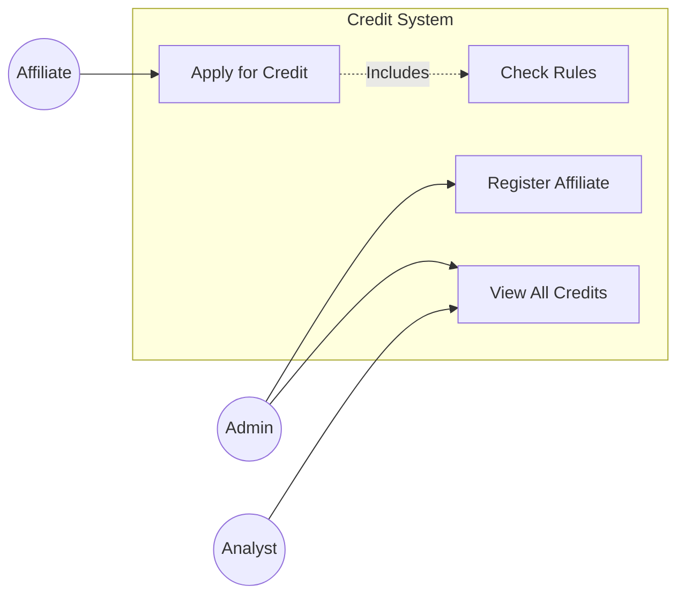

# CoopCredit 🏦

**CoopCredit** is a credit application management system built with **Java 17** and **Spring Boot 3**, following strict **Hexagonal Architecture** principles. It allows affiliates to register and apply for credits, which are evaluated against an external Risk Engine (Mock).

---

## 🏗 Architecture

The system is composed of two main microservices and a database, orchestrated via **Docker Compose**:


---

## 🎨 Diagrams

### 1. Microservices Diagram
Overview of the system components and their interactions in the Docker environment.

```mermaid
graph TD
    Client[Client (Web/Postman)] -->|HTTP/REST| Credit[Credit Service]
    Credit -->|JDBC| DB[(PostgreSQL)]
    Credit -->|HTTP/REST| Risk[Risk Service]
    
    subgraph Docker Network
        Credit
        Risk
        DB
    end
    
    style Credit fill:#85C1E9,stroke:#333,stroke-width:2px
    style Risk fill:#F1948A,stroke:#333,stroke-width:2px
    style DB fill:#F7DC6F,stroke:#333,stroke-width:2px
```

### 2. Hexagonal Architecture (Credit Service)
Detailing the "Ports & Adapters" structure within the Core Service.

```mermaid
graph TB
    subgraph Infrastructure ["Infrastructure (Adapters)"]
        Controller[Web Controller]
        RepoImpl[Persistence Adapter]
    end

    subgraph Application ["Application (Ports)"]
        InPort[Input Port (UseCase)]
        OutPort[Output Port (Repository Interface)]
    end

    subgraph Domain ["Domain Core"]
        Service[Domain Service]
        Model[Domain Model]
    end

    Controller -->|Calls| InPort
    InPort -.->|Implemented by| Service
    Service -->|Uses| Model
    Service -->|Calls| OutPort
    RepoImpl -.->|Implements| OutPort
    
    style Infrastructure fill:#EAEDED,stroke:#333
    style Application fill:#D4E6F1,stroke:#333
    style Domain fill:#D5F5E3,stroke:#333
```

### 3. Use Case Diagram
Functional capabilities available to the system actors.




1.  **Credit Application Service** (`credit-application-service`)
    *   **Core Domain**: Enforces business rules (e.g., salary limits, active status).
    *   **Architecture**: Pure **Hexagonal Architecture** (Ports & Adapters).
    *   **Security**: **JWT** (JSON Web Token) authentication with Role-Based Access Control (RBAC).
    *   **Persistence**: PostgreSQL managed by **Flyway**.

2.  **Risk Central Mock Service** (`risk-central-mock-service`)
    *   **Purpose**: Simulates an external credit bureau or risk engine.
    *   **Logic**: Deterministic risk evaluation based on document hash.

---

## 🚀 Tech Stack

*   **Language:** Java 17
*   **Framework:** Spring Boot 3.2.1
*   **Database:** PostgreSQL 15
*   **Migrations:** Flyway
*   **Security:** Spring Security + JJWT
*   **Testing:** JUnit 5, Mockito, Testcontainers
*   **Containerization:** Docker & Docker Compose
*   **Observability:** Prometheus, Grafana, Micrometer
*   **Tools:** Lombok, MapStruct, Maven

---

## 🛠️ Getting Started

### Prerequisites

*   Docker & Docker Compose
*   Java 17 & Maven (optional, if running locally without Docker)

### Run with Docker (Production)

To start the entire system (Database + Risk Service + Credit Service):

```bash
docker-compose up --build
```

### Run with Docker (Development with Hot Reload) 🔥

For development with **Hot Reload**, **Remote Debugging**, and **Monitoring** enabled:

```bash
docker-compose -f docker-compose.dev.yml up --build
```

**Development Ports:**
*   **Credit Service:** `http://localhost:8082` (Debug: `5005`)
*   **Risk Service:** `http://localhost:8081`
*   **Database:** `localhost:5434`
*   **Prometheus:** `http://localhost:9090` (Metrics)
*   **Grafana:** `http://localhost:3000` (Dashboards - User/Pass: `admin`)

---

## 📊 Observability

The project includes a complete monitoring stack:

1.  **Prometheus**: Scrapes metrics from `credit-service` and `risk-service` every 5 seconds via the `/actuator/prometheus` endpoint.
2.  **Grafana**: Visualization platform pre-configured to connect to Prometheus.

**How to visualize metrics:**
1.  Go to **Grafana** (`http://localhost:3000`).
2.  Login with `admin` / `admin`.
3.  Add Data Source: Select **Prometheus** and set URL to `http://prometheus:9090`.
4.  Import Dashboard: Use ID `4701` (JVM Micrometer) to see memory, CPU, and GC metrics.

---

## ✅ Compliance & Quality

This project has passed a strict **Senior Technical Audit**:
*   **Architecture:** Hexagonal Purity verified.
*   **Error Handling:** Implements **RFC 7807** (ProblemDetail).
*   **Security:** Stateless JWT with Role-Based Access Control.
*   **Observability:** Full metric exposure and visualization.
*   **DevOps:** Multi-Stage builds and Development Profiles.

---

## 🔌 API Reference

**Swagger UI:** `http://localhost:8082/swagger-ui.html`
*(Use credentials below to get a token and click "Authorize")*

### 1. Authentication (Public)
Get a token to access protected endpoints.
*   **POST** `/api/auth/login`
    ```json
    {
      "username": "admin",  // or "analyst", "affiliate"
      "password": "admin123" // or "analyst123", "affiliate123"
    }
    ```
    *Response:* `{ "token": "eyJh..." }`

### 2. Affiliates
*   **POST** `/api/affiliates` (Public) - Register a new affiliate.
    ```json
    {
      "name": "John Doe",
      "email": "john@email.com",
      "document": "DOC123",
      "salary": 5000.00
    }
    ```

### 3. Credits (Protected)
Requires `Authorization: Bearer <token>` header.

*   **POST** `/api/credits` - Apply for a credit.
    ```json
    {
      "affiliateId": 1,
      "amount": 10000.00,
      "term": 12
    }
    ```
*   **GET** `/api/credits` - List all credits (Role: ADMIN/ANALYST).
*   **GET** `/api/credits/affiliate/{id}` - List credits for an affiliate.

### 4. Risk Evaluation (Mock)
*   **POST** `/api/risk/evaluate`
    ```json
    {
      "documentId": "DOC123",
      "amount": 10000,
      "term": 12
    }
    ```

---

## 🧪 Testing

To run the test suite, including **Integration Tests** with **Testcontainers**:

```bash
mvn test
```

*Note: Docker must be running for Integration Tests to pass.*

---
**Author:** CoopCredit Team